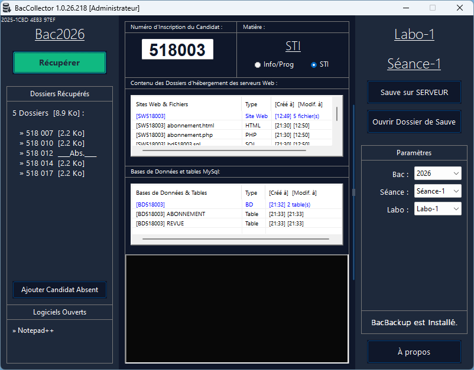
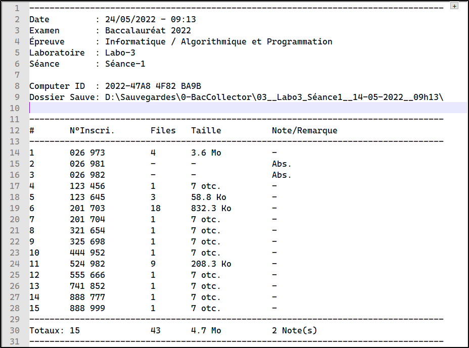
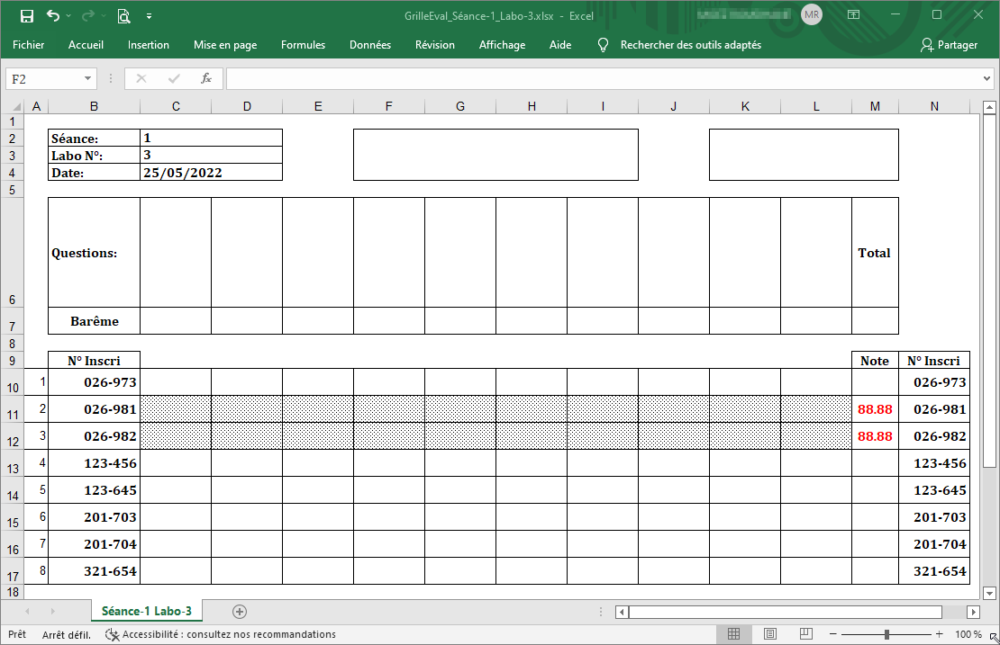

# BacCollector

[⬇️ Télécharger BacCollector](https://github.com/romoez/BacCollector/releases)

---

## Introduction

**BacCollector** est une application destinée à la collecte sécurisée et à la sauvegarde des travaux des candidats lors des épreuves pratiques du baccalauréat (Informatique/Programmation et STI).

### Objectifs principaux :

- **Standardisation** : Garantir un processus de récupération identique pour tous les candidats et dans tous les centres.
- **Assistance au surveillant** : Automatiser la détection du numéro de candidat et la collecte des travaux, assurant un gain de temps considérable par rapport à une procédure manuelle.
- **Maîtrise des risques humains et techniques** : Prévient les pertes de données (oublis, effacements, copies incorrectes) et sécurise la collecte, notamment en gérant les fichiers non enregistrés (logiciels ouverts) ou les conflits de doublons sur la clé.
- **Sécurisation des données** : Assurer une double sauvegarde systématique (clé USB + disque local protégé).
- **Réinitialisation du poste** : Nettoyage après récupération, recréation des dossiers et lancement d'une nouvelle session BacBackup (si installé).
- **Génération de documents** : Produire un rapport des travaux récupérés (PDF) et une grille d'évaluation Excel prête à l'emploi pour les correcteurs.

### Démonstration

  
_Démonstration du processus de récupération des travaux_

### Interface de BacCollector

  
_Interface principale de BacCollector_

---

## Détection Automatique du Numéro de Candidat

- **Pour Info/Prog** : Analyse des dossiers `C:\Bac\*2\*` pour extraire le numéro à 6 chiffres
- **Pour STI** : Recherche dans les dossiers `www/htdocs` et bases de données MySQL/MariaDB

---

## Processus de Récupération

### a. Matière Info/Prog

#### Emplacements Scannés :

| Emplacement                            | Critère de Sélection                                                                       | Recherche Récursive | Type                     |
| -------------------------------------- | ------------------------------------------------------------------------------------------ | ------------------- | ------------------------ |
| `C:\Bac\*2\*`                          | Dossiers racine obligatoires                                                               | Non                 | Dossiers entiers         |
| Bureau                                 | Modifiés < 120 min                                                                         | Oui                 | Fichiers + sous-dossiers |
| Mes Documents                          | Modifiés < 120 min                                                                         | Oui                 | Fichiers + sous-dossiers |
| Téléchargements                        | Modifiés < 120 min                                                                         | Oui                 | Fichiers                 |
| Profil utilisateur                     | Modifiés < 120 min. Extensions spécifiques: `.py,.ipynb,.ui,.accdb,.xls*,.csv,.doc*,.ppt*` | Non                 | Fichiers                 |
| `C:\Res*ource*`                        | Dossiers correspondant au masque                                                           | Non                 | Dossiers entiers         |
| Racines des lecteurs fixes (C:, D:...) | Modifiés < 120 min OU masque `Bac*2*`                                                      | Non                 | Fichiers + Dossiers      |

### b. Matière STI

- **Détection des environnements serveurs** : Identification automatique des installations XAMPP-Lite, XAMPP ou WAMP.
  - Sites web : recherche des dossiers racines `www` ou `htdocs`.
  - Bases de données : localisation des dossiers `data` de MySQL ou MariaDB.

- **Traitement des bases de données** :
  - Le dossier `data` complet est compressé au format ZIP à l'aide d'un moteur intégré.
  - La version exacte du serveur de bases de données (MariaDB ou MySQL) est détectée et enregistrée dans un fichier séparé, accompagné d'une procédure de restauration claire en cas de besoin.

- **Récupération complémentaire** : En plus des éléments spécifiques à STI, BacCollector applique également pour cette matière les mêmes recherches des matières Info/Prog : les dossiers `C:\Bac\*2\*`, les fichiers récents du Bureau, Mes documents, Téléchargements, profil utilisateur et les racines des autres lecteurs fixes sont scannés et récupérés.

---

## Scénarios de fonctionnement et messages au surveillant

### a. Phase de pré-vérification (avant toute copie)

| Situation                                                              | Message affiché                                                                                                                                                                                  | Action logicielle                                                                                                                                                 |
| ---------------------------------------------------------------------- | ------------------------------------------------------------------------------------------------------------------------------------------------------------------------------------------------ | ----------------------------------------------------------------------------------------------------------------------------------------------------------------- |
| Numéro de candidat invalide (pas 6 chiffres)                           | « XXXXXX n'est pas un numéro d'inscription valide » (rouge)                                                                                                                                      | Récupération annulée.                                                                                                                                             |
| Des applications sensibles sont ouvertes (éditeurs, bureautique, etc.) | « Veuillez fermer ce(s) logiciel(s) : [liste] » (rouge)                                                                                                                                          | Blocage : l'utilisateur doit fermer les applications pour continuer.                                                                                              |
| Un dossier portant le numéro du candidat existe déjà sur la clé USB    | « Un dossier de même nom existe déjà sur la Clé USB » (rouge)                                                                                                                                    | Récupération annulée (évite l'écrasement).                                                                                                                        |
| Info/Prog : Aucun dossier `C:\Bac\*2\*` trouvé                         | « Aucun dossier 'Bac20xx' sous la racine 'C:' ! » (rouge)                                                                                                                                        | Récupération annulée.                                                                                                                                             |
| Info/Prog : Dossiers Bac trouvés mais tous vides                       | « Le dossier Bac ne contient aucun travail » (orange) avec choix « Générer et Continuer » ou « Annuler »                                                                                         | Si « Générer », un fichier `_NOTE_AU_CORRECTEUR.txt` est créé dans le dossier Bac, puis la récupération se poursuit. Si « Annuler », la récupération est stoppée. |
| STI : Aucun dossier racine (www ou htdocs) trouvé                      | Message détaillé indiquant les causes possibles et conseillant de vérifier l'installation du serveur local (rouge)                                                                               | Récupération annulée.                                                                                                                                             |
| STI : Dossiers racines trouvés mais tous vides (aucun fichier)         | « Aucun contenu à récupérer dans les dossiers www/htdocs : [liste] » (orange) avec choix « Oui » ou « Non » pour poursuivre vers la recherche des bases de données.                              | Si « Oui », on passe à la phase suivante. Si « Non », récupération annulée.                                                                                       |
| STI : Aucun dossier data (bases de données) trouvé                     | Message d'erreur avec conseils (rouge)                                                                                                                                                           | Récupération annulée.                                                                                                                                             |
| STI : Dossiers data trouvés mais aucune base utilisateur               | Message d'avertissement avec choix « Oui » ou « Non » (si un site web a déjà été trouvé) ; sinon, message proposant une procédure manuelle (créer un dossier `AUCUN_TRAVAIL.txt`) et annulation. | Selon le choix, on continue sans les bases ou on annule.                                                                                                          |

### b. Phase de récupération (pendant la copie)

| Situation                                                                                                             | Message/Action                                                                                           |
| --------------------------------------------------------------------------------------------------------------------- | -------------------------------------------------------------------------------------------------------- |
| Échec de la création du dossier de destination sur la clé USB (espace insuffisant, protection en écriture, antivirus) | Message d'erreur (rouge) avec explications et annulation immédiate.                                      |
| Info/Prog : Échec de la copie d'un dossier Bac vers la clé USB                                                        | Message d'erreur (rouge) et annulation de la récupération.                                               |
| STI : Échec de la copie d'un dossier web vers la clé USB                                                              | Idem, annulation.                                                                                        |
| STI : Le dossier web de destination ne contient que des sous-dossiers (aucun fichier)                                 | Création automatique d'un fichier `_NOTE_AU_CORRECTEUR.txt` dans les copies pour expliquer la situation. |
| STI : Échec de la copie du fichier ZIP vers la clé USB                                                                | Message d'erreur (rouge) et annulation.                                                                  |

### c. Phase post-récupération

| Situation                                                         | Message affiché (couleur)                                                                            |
| ----------------------------------------------------------------- | ---------------------------------------------------------------------------------------------------- |
| Succès total (Info/Prog ou STI avec site et bases)                | « La récupération du travail du candidat N° XXXXXX a été effectuée avec succès ! » (vert)            |
| STI : Site web présent mais bases de données absentes             | « La récupération du candidat N° XXXXXX est terminée, mais la BASE DE DONNÉES est absente. » (jaune) |
| STI : Bases présentes mais site web absent                        | « La récupération du candidat N° XXXXXX est terminée, mais le SITE WEB est absent. » (jaune)         |
| Récupération terminée avec une ou plusieurs erreurs non critiques | « [X] erreur(s) est/sont produite(s) lors de cette opération. Veuillez lire le journal. » (orange)   |

À l'issue de chaque récupération réussie, BacCollector tente de créer une nouvelle session de surveillance BacBackup pour le poste, assurant ainsi une protection continue.

---

## Sécurité et intégrité

### a. Suppression sécurisée des sources

Les dossiers sources (travaux des candidats) ne sont supprimés qu'après une copie réussie vers la clé USB, garantissant qu'aucune donnée n'est perdue en cas d'échec intermédiaire.

### b. Protection du dossier de sauvegarde local

Une copie miroir de tous les travaux est systématiquement créée dans un dossier local (par défaut `C:\Sauvegardes\BacCollector\`). Ce dossier est configuré pour interdire toute suppression ultérieure.

L'accès à ce dossier s'effectue uniquement via l'interface de BacCollector.

### c. Détection des fraudes (intégration avec BacBackup)

Si l'outil de surveillance BacBackup est installé et détecte une utilisation non autorisée de périphérique USB, le dossier `_UsbWatcher` contenant les preuves (captures d'écran, journaux) est automatiquement copié dans la sauvegarde du candidat.

Un fichier d'alerte explicite (`_ALERTE_FRAUDE_USB.txt`) est généré pour signaler l'incident au surveillant/coordinateur, avec date, heure et description.

### d. Traçabilité complète

Toutes les actions de BacCollector sont enregistrées dans un journal horodaté détaillé. Ce journal est systématiquement copié dans chaque dossier de sauvegarde, permettant une reconstitution précise du déroulement de la récupération.

---

## Génération de Rapports

### a. Rapport PDF

- **Génération sans dépendance externe**
- **Contenu** :
  - Liste des candidats avec statistiques (nombre fichiers, extensions, taille)
  - Informations de session (labo, séance, date)
  - Matière et année du bac
  - Notes pour le correcteur

  
_Exemple de rapport PDF généré_

### b. Grille d'Évaluation Excel

- **Génération sans dépendance à Excel**
- **Contenu** :
  - Liste des candidats
  - Colonnes pour notation
  - Formules de calcul automatique
- **Format** : `.xlsx` compatible avec tous les tableurs

  
_Grille d'évaluation Excel générée_

---

## Autres fonctionnalités et propriétés

### a. Interface utilisateur intuitive

- **Infobulles contextuelles** : Chaque élément de l'interface affiche une infobulle explicative au survol, détaillant son rôle et son usage.
- **Déplacement fluide de la fenêtre** : Déplacement avec un "cliquer-glisser" depuis n'importe quelle zone de la fenêtre en maintenant enfoncée la molette de la souris.
- **Navigation par double-clic** :
  - Sur la liste des dossiers récupérés : ouverture directe du dossier dans l'Explorateur Windows.
  - Sur un fichier/dossier détecté : affichage immédiat de l'élément dans son emplacement d'origine.
- **Consultation du journal** : Double-clic sur la zone de log ouvre automatiquement le fichier journal dans WordPad ou Microsoft Word (si installé).

### b. Gestion des périphériques et environnement

- **Utilisation simultanée de plusieurs clés USB** : Possibilité d'exploiter plusieurs clés USB en parallèle dans le même laboratoire (chaque clé gère son propre flux de récupération).
- **Renommage automatique des clés** : Attribution automatique du nom « Labo-X » à la clé USB selon le laboratoire sélectionné (modification du label du lecteur).
- **Saisie manuelle alternative** : Possibilité de modifier ou saisir manuellement le numéro d'inscription.
- **Actualisation dynamique** : Clic sur le libellé de la matière (Info/Prog ou STI) rafraîchit immédiatement la détection des éléments sources.

### c. Gestion des absents

- **Marquage des candidats absents** : Bouton dédié pour créer un dossier structuré `[Numéro]\Absent`, servant de preuve numérique d'absence.
- **Détection des dossiers non conformes** : Alertes automatiques si un dossier vide ne contient pas le sous-dossier marqueur « Absent ».

### d. Intégration avec BacBackup

- **Accès direct à BacBackup** : Lien cliquable vers l'interface de BacBackup sans mot de passe.
- **Collecte des preuves de fraude** : Récupération automatique des captures d'écran et journaux en cas de détection d'utilisation non autorisée de périphérique USB.
- **Interface UsbCleaner** : Accès rapide à la page de téléchargement d'UsbCleaner pour la préparation des clés USB.

### e. Prêt à l'emploi

- **Aucune configuration préalable requise** : Lancement immédiat depuis la clé USB sans installation, paramétrage ou dépendance externe.
- **Identifiant machine unique** : Génération automatique d'un UUID par poste pour la traçabilité technique (copiable via un clic sur le label dédié).
- **Adaptabilité matérielle et logicielle** : Fonctionne sur toutes les versions de Windows sans prérequis logiciel spécifique.

---

## Licence

Ce projet est sous licence [GPL-3.0](LICENSE).

## Liens utiles

- [Téléchargements](https://github.com/romoez/BacCollector/releases)
- [BacBackup](https://github.com/romoez/BacBackup) - Outil de surveillance complémentaire
- [Signaler un bug](https://github.com/romoez/BacCollector/issues)
